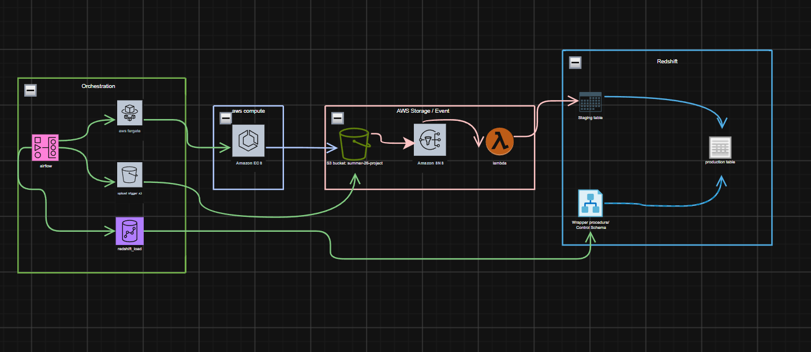

# Summer 26 — Scalable AWS Data Pipeline Platform

Containerized application which is a scalable, secure backend data platform built to run on AWS. The public data source (Alpha Vantage stock data and US Treasury FiscalData) is pulled periodically, validated, and pushed to an in-house Redshift database. All of it’s contained within containers, run on ECS Fargate – no managing of virtual/physical servers for us!

> Vision (from `docs/notes.md`): build our own dedicated database to handle
> data, using a containerized setup so we don't deal with managing servers.

## Architecture



**Full flow:**
1. **Extract** — ECS Fargate containers call the source APIs and write a
   full dataset as a single gzip CSV to S3. Since **KAN-49**, the FiscalData
   extractors read a watermark from DynamoDB and only fetch new records
   (`filter=record_date:gte:<watermark>`), then merge them into the existing
   S3 CSV and re-upload (skipping the upload entirely when nothing changed).
2. **Ingest** — an S3 put event fans out via SNS to a Lambda that:
   - resolves the target schema/table from `metadata/table_mapping/metadata_schema_mapping.csv`,
   - reads only the CSV header (never the whole file),
   - validates header ⇔ metadata ⇔ Redshift table columns,
   - runs `TRUNCATE TABLE` + `COPY` into the `source_fiscaldata` staging table.
3. **Orchestrate / Transform** — Airflow DAGs trigger the ECS extraction tasks
   and then run stored procedures that move data from staging into the main
   tables using change detection (a `control` schema + `e_*` views +
   `sp_load_delete_insert`), so unchanged rows are not rewritten.

## Datasets

### Treasury FiscalData (3) — incremental via DynamoDB watermark
| Dataset | Table | Natural key (dedupe) |
|---|---|---|
| Operating Cash Balance | `source_fiscaldata.operating_cash_balance` | `(record_date, account_type, src_line_nbr)` |
| Deposits & Withdrawals of Operating Cash | `source_fiscaldata.deposits_withdrawals_operating_cash` | `(record_date, transaction_type, src_line_nbr)` |
| Treasury Reporting Rates of Exchange | `source_fiscaldata.treasury_reporting_rates_exchange` | `(record_date, country, currency, src_line_nbr)` |

### Alpha Vantage (5)
`gdp` (REAL_GDP), `exchange_rates` (FX_DAILY), `company_overview`,
`daily_stock` (TIME_SERIES_DAILY), `news_sentiment` — in `src/alpha_vantage/`.

## Getting started (local setup)

### 1. Prerequisites
- **Python 3.13+** — `requests`, `boto3`, `pandas` (see `requirements.txt`).
- **AWS credentials** — an IAM user/role with access to S3, DynamoDB, ECS,
  Redshift, Lambda, SNS (see [Provisioning](#provisioning)).
- **Docker** — for running local Airflow and building/pushing images.
- **API keys** — Alpha Vantage key (and a Redshift connection for loads).

### 2. Clone & install
```bash
git clone <repo-url> summer_26
cd summer_26

python -m venv .venv
# activate:
#   Windows (Git Bash):  source .venv/Scripts/activate
#   Windows (PowerShell): .venv\Scripts\Activate.ps1
#   macOS/Linux:         source .venv/bin/activate
pip install -r requirements.txt
```

### 3. Configure `settings.ini`
`settings.docker.ini` is the template (no secrets) and is the file baked into
the Docker image. Copy it locally and fill in your own values:
```bash
cp settings.docker.ini settings.ini   # then edit:
```
```ini
[credentials]
api_key = <your-alpha-vantage-key>

[aws]
region = eu-west-1
...
```
> Keep `settings.ini` and `settings.docker.ini` in sync — the image only
> sees the docker variant (the Dockerfile copies it to `./settings.ini`).

### 4. AWS credentials
```bash
aws configure                          # region eu-west-1
aws sts get-caller-identity            # verify it returns your account
```

### 5. Run an extractor locally
```bash
python src/fiscal_data/operating_cash_balance.py        # incremental (default)
python src/fiscal_data/operating_cash_balance.py --full # full reload
```
On the first run there is no watermark, so it does a full fetch; subsequent
runs are incremental (see [DynamoDB watermark store](#dynamodb-watermark-store-kan-49)).

### 6. Local Airflow (optional)
```bash
cd airflow
docker compose up -d      # postgres + scheduler + webserver
# Web UI: http://localhost:8080  (user: airflow / password: airflow)
```
Add a `redshift_wdp_dev` connection for the load DAGs.

### 7. Provision AWS resources
```bash
python scripts/setup-iam.py         # ECS task + execution roles
python scripts/setup-dynamodb.py    # state table + ecsTaskRole policy
```

### 8. Deploy the extractor image
See [Build & deploy](#build--deploy).

## Project structure

```
.
├── src/
│   ├── alpha_vantage/           # AV extractors (5)
│   └── fiscal_data/             # Treasury extractors (3) + dynamodb_state.py
├── lambda/
│   └── lambda_function.py       # S3 → SNS → Redshift validation + COPY
├── airflow/
│   ├── dags/                    # ECS trigger DAGs + redshift_loads_fiscaldata
│   └── docker-compose.yaml      # local Airflow (CeleryExecutor)
├── infra/
│   ├── redshift/                # schemas, main tables, e_views, procedures
│   ├── task-definitions/        # per-dataset ECS task definitions
│   ├── task-role-policy.json    # ECS task IAM policy
│   ├── trust-policy.json        # ECS task assume-role policy
│   └── dynamodb-state-table.json# KAN-49 watermark table definition
├── metadata/                    # *_stg_metadata.csv + table_mapping/
├── scripts/                     # setup-iam, setup-dynamodb, run-fargate-task
├── settings.ini                 # local config (gitignored)
├── settings.docker.ini          # config baked into the ECS image
├── Dockerfile
└── requirements.txt
```

## DynamoDB watermark store (KAN-49)

| Property | Value |
|---|---|
| Table | `summer-26-pipeline-state` (region `eu-west-1`) |
| Partition key | `dataset` (String) — one item per dataset |
| Item attributes | `last_record_date` (YYYY-MM-DD), `record_count`, `last_run_at` |
| Billing mode | `PAY_PER_REQUEST` |

Shared module [src/fiscal_data/dynamodb_state.py](src/fiscal_data/dynamodb_state.py):
- `get_watermark(dataset)` / `set_watermark(...)` — read/upsert watermark.
- `merge_upload(...)` — downloads the existing S3 CSV, appends new rows last,
  dedupes on the dataset natural key (`keep="last"` so corrections win),
  sorts deterministically, re-uploads only when content changed.

Each FiscalData extractor:
- fetches `filter=record_date:gte:<watermark>` (full history on first run),
- validates the watermark format before requesting (400 is also the
  end-of-pages sentinel in the API client),
- exits `0` with "No new data" when there is nothing to fetch,
- advances the watermark to `max(record_date)` — never to "today",
- supports `--full` for manual/emergency full reloads.

> Live verification (2026-07-31): operating_cash_balance 16,482 rows
> (watermark 2026-07-29), deposits_withdrawals 476,889 rows / 477 pages
> (watermark 2026-07-29), treasury rates 18,978 rows (watermark 2026-06-30).
> The second run of each dataset fetched only a few rows and skipped upload.

## Redshift

Schemas:
- `source_fiscaldata` — staging + main tables for the 3 Treasury datasets.
- `control` — pipeline bookkeeping (`sp_load_delete_insert`).

Per dataset (in `infra/redshift/`):
- `main_table/*.sql` — main table DDL (with `meta_` audit columns, e.g.
  `meta_loaded_at DEFAULT GETDATE()`).
- `e_view/*.sql` — change-detection views between stg and main.
- `procedure/*.sql` — wrapper stored procedures for the stg→main transfer.

## Lambda ingestion

[lambda/lambda_function.py](lambda/lambda_function.py) — triggered by SNS on
every S3 put (metadata files are skipped). Requires env vars
`BUCKET`, `WORKGROUP`, `DATABASE`. Uses the Redshift Data API
(`redshift-data`), validates columns three ways (CSV header, metadata file,
`information_schema`), then `TRUNCATE` + `COPY` with an explicit column list.

## Airflow

- `operating_cash_balance_fargate.py`, `deposits_withdrawals_operating_cash_fargate.py`,
  `treasury_reporting_rates_exchange_fargate.py` — `EcsRunTaskOperator` jobs.
- `daily_gdp_fargate.py` — GDP extractor.
- `redshift_loads_fiscaldata.py` — daily stg→main load for all 3 datasets
  via `SQLExecuteQueryOperator` (connection `redshift_wdp_dev`).
- `upload_triger_to_s3.py` — helper trigger.

## Configuration

[settings.ini](settings.ini) (local, gitignored) and
[settings.docker.ini](settings.docker.ini) (baked into the image — the
Dockerfile copies it to `settings.ini`). Both must stay identical. Sections:
`api`, `fiscaldata`, `data`, `credentials`, `exchange_rate`, `aws`, `storage`,
`company_overview`, `daily_stock`, `news_sentiment`,
`operating_cash_balance`, `deposits_withdrawals_operating_cash`,
`treasury_reporting_rates_exchange`, `dynamodb`.

## Provisioning

```bash
# IAM roles (ECS task + execution)
python scripts/setup-iam.py

# DynamoDB state table + ecsTaskRole inline policy (KAN-49)
python scripts/setup-dynamodb.py
```


## Build & deploy

```bash
# Build the image that all FiscalData task definitions use
docker build -t summer26-pipeline:latest .


Task definitions in `infra/task-definitions/` override the container command
(e.g. `python src/fiscal_data/operating_cash_balance.py`), run on ECS Fargate
in the `gdp-cluster` cluster under the `ecsTaskRole`.

> Note: the Dockerfile `CMD` still points at `src/last_10_years_gdp.py`
> (the original single-script container) and is always overridden by the
> task definitions. Update it if the image is ever run directly.

## Local run

```bash
# Requires AWS credentials + settings.ini [aws] region
python src/fiscal_data/operating_cash_balance.py            # incremental (default)
python src/fiscal_data/operating_cash_balance.py --full     # force full reload
```
